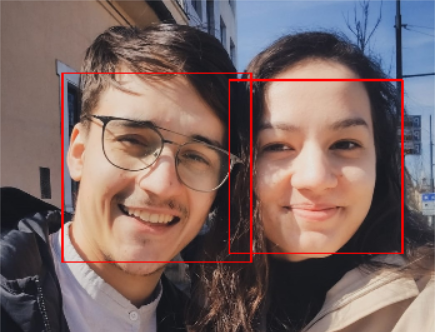

# Face Detection and Camera Motion Detector

# First: Face Detection
 ## Main Idea:
  - uploading a Haar Cascade XML file (for this case, the frontal face one) using the OpenCV library and using OpenCV we find the coordinates of the given face and plot rectangles over them
  

 What is Haar Cascade? 

It is an Object Detection Algorithm used to identify faces in an image or a real time video. The algorithm uses edge or line detection features proposed by Viola and Jones in their research paper “Rapid Object Detection using a Boosted Cascade of Simple Features” published in 2001. The algorithm is given a lot of positive images consisting of faces, and a lot of negative images not consisting of any face to train on them. The model created from this training is available at the OpenCV GitHub repository https://github.com/opencv/opencv/tree/master/data/haarcascades

 Example Image: 

  
  
  

# Second: Camera Motion Detector
 ## Main Idea:
 - using OpenCV, the script acceses (in this case the laptop's) camera and plot rectangles over objects in motion. [^1]
 BONUS: the tracked movements are then stored in a csv and, using `pandas` and `bokeh` libraries, are plotted on a graph [^2]
 
 

 Example Detection: 

  
  
  

 
 
 [^1]: For the script to properly work, the first "captured" frame should be the "background" as it will compare the next frames.
 [^2]: A real-case example would be tracking wild animals in Reservation Parks (seeing a fast-forwarded month of wildlife tracking in the Retezat National Park actually inspired me to proceed with this fun little project - helpful here was Ardit Sulce's Mega Python Course)
